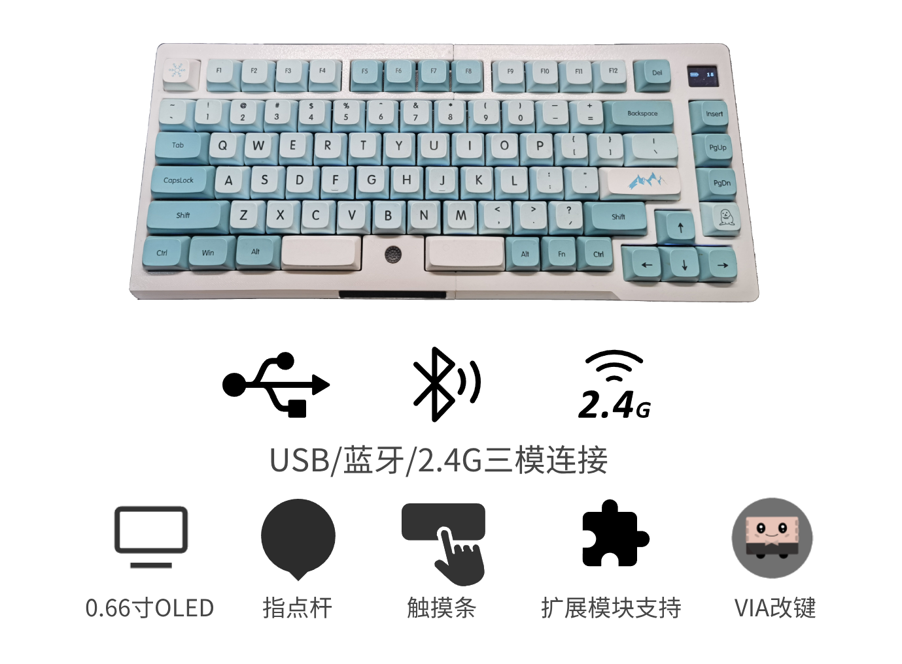
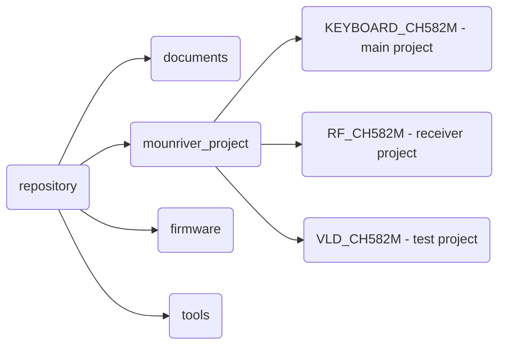

<h1 align="center">TrackPoint78 </h1>

<h5 align="center">Three mode trackpoint mechanical keyboard</h5>

<a href="./README.md">简体中文</a> <a href="./README-EN.md">English</a>

TP78 is a three mode mechanical keyboard project. It is designed to meet the four fundamental needs of portable wireless, custom, shortcut keys and trackpoint. TP78 is based on the 75% keyboard configuration and uses a touchbar to achieve the left, middle and right buttons. OLED, USB HUB and magnetic interface are also integrated. TP78 shell can be printed and assembled by bambulab A1mini or other 3D printers.

TP78v2 uses CH582M as the main control MCU, supports USB/BLE/RF three-mode, and the coupled wireless has a 1K return rate. (current repository)

TP78v3 uses Hi2821 as the main control core, supports USB/BLE/SLE three modes, wired 8K report rate, nearlink 2K report rate. ([direct to TP78v3 repository](https://github.com/ChnMasterOG/tp78_v3_open))

 **(Join QQ group: ①678606780(full), ②904775488 for learning more and communications)**

V2.0 ：Video shown in bilibili：[【软软核】为自己做一把小红点三模键盘\_哔哩哔哩\_bilibili](https://www.bilibili.com/video/BV1Ho4y1b78t/)

V2.1：Video shown in bilibili： [TP78指点杆三模键盘-Gasket版出炉啦 (速来拼车)_哔哩哔哩_bilibili](https://www.bilibili.com/video/BV1fA4m1V7DX/)

1. 【V2.1】Update bootloader(kboot) to support firmwares draging upgrade which is available for purchased board.
2. 【V2.1】Optimize the Gasket shell structure for easier 3Dprint or CNC.
3. 【V2.1】Optimize sliding functions of the touchbar.
4. Support VIA keycodes setting.
5. Support U-disk keycodes setting and function setting.
6. Support a touchbar or a capmouse.
7. Integrate the USB hub interface.
8. Add two magnetic extend ports.
9. Add RF 2.4G mode and a RF receiver project.
10. Support the I2C trackpoint.
11. Add vibration feedback function when the touchbar is working.
12. Add more beautiful OLED UI.
13. Add more Fn functions.
14. Add lowpower modes.

### Follow us to get more fun DIY projects

bilibili：@i丶m皮皮 @阿炜阿阿炜阿

Tik Tok：@i丶m皮皮

### Purchase link(Global purchasable)

[淘宝(taobao.com)](https://item.taobao.com/item.htm?id=765881659540)

### List of Extension Modules Supported by TP78(Global purchasable)

Video shown in bilibili：[https://www.bilibili.com/video/BV1jVpneNEpq/](https://www.bilibili.com/video/BV1jVpneNEpq/)

1. TP78foc —— A FOC controlled motor knob, small keyboard expansion module
   
   purchase link: [淘宝(taobao.com)](https://item.taobao.com/item.htm?ft=t&id=828180761483)

2. TP78mini —— A three mode examination digital keypad module
   
   purchase link: [淘宝(taobao.com)](https://item.taobao.com/item.htm?ft=t&id=832953135960)

intrudoction video：[【开源】历时3年，打造一个模块化力反馈旋钮小键盘](https://www.bilibili.com/video/BV1jVpneNEpq/)

### Download models

https://makerworld.com/zh/models/172159#profileId-189031

### Download PCBs

https://oshwhub.com/bibilala/tp78_2022-08-31

### Download codes

https://github.com/ChnMasterOG/tp78_v2

### Download firmwares

https://github.com/ChnMasterOG/tp78_v2/releases/

### Tutorials

https://github.com/ChnMasterOG/tp78_v2/blob/main/documents/TP78v2指导文档.pdf

### Materials list

### PCB

| PCB Name    | Description                   | Board Thickness                |
| ----------- | ----------------------------- | ------------------------------ |
| 0.键盘主板      | keyboard PCB                  | 1.6mm                          |
| 1.Hub供电板    | USBhub PCB                    | 1.0mm                          |
| 2.Minimal_2 | M.2 interface CH582M core PCB | 0.8mm（Gold pads）               |
| 3.触摸条       | touchbar PCB                  | 1.2mm （Pay attention to color） |
| 4.磁吸转接小板    | magnetic module PCB           | 1.0mm                          |
| 5.接收器       | 2.4GHz receiver PCB           | 0.8mm（Gold pads）               |

### Shell

| File Name                  | Description                         |
| -------------------------- | ----------------------------------- |
| 底座左 Left Bottom Case.step  | Left side of the keyboard           |
| 底座右 Right Bottom Case.step | Right side of the keyboard          |
| 定位板左 Left Plate.step       | Left side of the positioning plate  |
| 定位板右 Right Plate.step      | Right side of the positioning plate |
| 上盖左 Left Top Case.step     | Left side of the cover              |
| 上盖右 Right Top Case.step    | Right side of the cover             |

### Other Hardwares

| Name                           | Specification | Number | Purchase link                                                                                                                                                                                                                                                                                                                                                                                                                                                                                                                                                                                                                            |
| ------------------------------ | ------------- | ------ | ---------------------------------------------------------------------------------------------------------------------------------------------------------------------------------------------------------------------------------------------------------------------------------------------------------------------------------------------------------------------------------------------------------------------------------------------------------------------------------------------------------------------------------------------------------------------------------------------------------------------------------------- |
| M2×3 screw                     | M2×3          | 4      |                                                                                                                                                                                                                                                                                                                                                                                                                                                                                                                                                                                                                                          |
| M2×5 screw                     | M2×5          | 4      |                                                                                                                                                                                                                                                                                                                                                                                                                                                                                                                                                                                                                                          |
| M2×11 screw                    | M2×11         | 8      |                                                                                                                                                                                                                                                                                                                                                                                                                                                                                                                                                                                                                                          |
| M2×2×3 Knurled nut             | M2×2×3        | 14     |                                                                                                                                                                                                                                                                                                                                                                                                                                                                                                                                                                                                                                          |
| M2×18 plug                     | M2×18         | 3      |                                                                                                                                                                                                                                                                                                                                                                                                                                                                                                                                                                                                                                          |
| silicone pad                   | 5×8，2.8×12    | 12     | https://item.taobao.com/item.htm?_u=q2jjkhi69cd7&id=744647593898&spm=a1z09.2.0.0.af932e8d0BlsxD&sku_properties=1627207:107121                                                                                                                                                                                                                                                                                                                                                                                                                                                                                                            |
| NGFF M.2 copper pillar-1.5H M3 | 1.5H M3       | 1      | https://item.taobao.com/item.htm?app=chrome&bxsign=scdEkAVMVexd7f8Q7UzuApXa4j1r_JD9G4td5HaaWVChIkPjmiw1mdLib_8g4SRe2vWDNuoFUCKcu-ejr9A1uJwoDsc538qN83wsPZPpYKL7QjkTn9bV8RsvlvkjlMOVoLH&cpp=1&id=618677416528&price=0.26-0.8&shareUniqueId=25308625613&share_crt_v=1&shareurl=true&short_name=h.5rLwYPpOifZrW9B&skuId=4836714229115&sourceType=item,item&sp_abtk=gray_1_code_simpleAndroid2&sp_tk=VG1oMFdSQ2NvUkM=&spm=a2159r.13376460.0.0&suid=95bb0d99-7ae4-428d-8994-c13b7072fe1e&tbSocialPopKey=shareItem&tk=Tmh0WRCcoRC&un=a40571f7eec624d4b0ea5e6b515c0e5c&un_site=0&ut_sk=1.YDpH0Uzm8dUDAG5lU8oOTXSt_21646297_1706280814125.Copy.1 |
| M3*4 screw                     | M3×4          | 1      |                                                                                                                                                                                                                                                                                                                                                                                                                                                                                                                                                                                                                                          |
| RF receiver shell              |               | 1      | https://item.taobao.com/item.htm?_u=q1p8ioog4b10&id=534100629624&spm=a1z09.2.0.0.ffb12e8doHDWhm                                                                                                                                                                                                                                                                                                                                                                                                                                                                                                                                          |

### Other Electronic Components and Wires

| Name                                    | Name | Purchase link                                                                                                          |
| --------------------------------------- | ---- | ---------------------------------------------------------------------------------------------------------------------- |
| YDX-C09 trackpoint                      | 1    |                                                                                                                        |
| trackpoint hat                          | 1    | https://item.taobao.com/item.htm?_u=q2jjkhi630e3&id=598814658945&spm=a1z09.2.0.0.af932e8dbSeo4W                        |
| 0.66 inches OLED 6448(ssd1306)          | 1    | https://item.taobao.com/item.htm?abbucket=14&id=532909628316&ns=1&spm=a21n57.1.0.0.4d20523cgGuatR                      |
| magnetic attractions                    | 1    | https://item.taobao.com/item.htm?_u=q1p8ioog0426&id=567899628697&spm=a1z09.2.0.0.ffb12e8doHDWhm&skuId=4855618049480    |
| MX1.25MM double head reversed 10p 150mm | 1    | https://item.taobao.com/item.htm?_u=q1p8ioog7751&id=17860990732&spm=a1z09.2.0.0.ffb12e8doHDWhm                         |
| MX1.25MM double head 6p 150mm           | 2    | https://item.taobao.com/item.htm?_u=q1p8ioog7751&id=17860990732&spm=a1z09.2.0.0.ffb12e8doHDWhm                         |
| MX1.25MM single head 6p 100mm           | 1    | https://item.taobao.com/item.htm?_u=q1p8ioog9ebc&id=21014043282&spm=a1z09.2.0.0.ffb12e8doHDWhm                         |
| 2pin motor power cable                  | 1    | https://item.taobao.com/item.htm?_u=q1p8ioog9e2a&id=650661513310&spm=a1z09.2.0.0.ffb12e8doHDWhm                        |
| motor                                   | 1    | https://item.taobao.com/item.htm?_u=q1p8ioog403c&id=695661440091&spm=a1z09.2.0.0.ffb12e8doHDWhm                        |
| FPC 8p reversed 30cm                    | 1    | https://item.taobao.com/item.htm?_u=q1p8ioog75f1&id=549590794021&spm=a1z09.2.0.0.ffb12e8doHDWhm&sku_properties=-1:-1   |
| IPEX 2.4G                               | 1    | https://item.taobao.com/item.htm?id=590679216827&skuId=4637409672288&spm=a1z0d.6639537/tb.1997196601.52.33917484vHyEWs |

### Assembly Steps

Reference the V2.0 video 

### Repository Directory

### Change Keys Tutorials

**VIA：** https://www.bilibili.com/video/BV1rL41167qy

**KEY MACRO：** https://www.bilibili.com/video/BV1Yu4y1S73Q

### Q&A

- **Q**: How to enter WCH ROM bootloader（not recommended for non-developers）？

- **A:** Press and hold the boot button on the baseboard to power on.

- **Q**: How to enter kBoot？

- **A:** Fn+B or press and hold the ESC key on the baseboard to power on.

- **Q**: How to enter the RF receiver bootloader？

- **A:** After entering RF mode, connect the receiver and press Fn+**ESC** to enter the ROM bootloader. Note: The first 4K of CodeFlash will be erased after the receiver enters the bootloader, and the program must be downloaded first after powering on. If you need to upgrade the receiver firmware and keyboard main firmware at the same time, upgrade the receiver firmware first and then upgrade the keyboard main firmware. Be careful not to flash the wrong receiver firmware, otherwise you will be unable to connect and enter the bootloader again.

- **Q:** How to use WCH ISPTools?

- **A:** Tool directory：tools/WCHISPTool/WCHISPTool_Setup.exe
  
  > - Double-click the software installation tool and related drivers；
  > 
  > - MCU series selection: "32-bit low-power Bluetooth series", chip selection: CH58x, chip model: CH582；
  > 
  > - Find your device in the USB device list. If it cannot be found, try re-entering BOOT；
  > 
  > - Check the relevant download configuration according to your needs. Generally, you can use the default configuration；
  > 
  > - Select target program file 1 and check the option box on the right；
  > 
  > - Finally click download.

- **Q**: Flashing firmware for the first time and OLED shows FATFS-FAIL（Solution A）

- **A:** The first download requires flashing the production firmware (or compiling the production firmware by opening the FIRST_USED macro in HAL.h). After flashing, pop up the USB disk and select format. After formatting, power off and restart. Restart and flash the official version of the firmware. After flashing, make sure that the configuration information of the official version of the firmware is the latest. You need to press Fn 5 times to reset the configuration. After resetting, restart the keyboard and it will work normally.

- **Q**: Flashing firmware for the first time and OLED shows FATFS-FAIL（Solution B - recommended）

- **A:** When flashing firmware for the first time, check the DataFlash file, select firmware/DefaultFS.BIN, and click download. After flashing, make sure the firmware configuration information is the latest. You need to press Fn 5 times to reset the configuration.

### Submit Your Codes

You can submit you code [here](https://github.com/ChnMasterOG/tp78_v2/issues). Thanks for your support of TP78.

### Relase Note

- V2.0.11

        1. Fixed the problem that some hardware OLEDs do not works when powered on.

        2. Add release firmwares with start address 0x0.

        3. Fixed BUG: Any button that pops up will cause all buttons to pop up.

- V2.0.12

        1. Add Game Mode(Improving keyboard performance at the cost of sacrificing some features).

        2. Change function(RF bootloader jumping) Fn+M to Fn+ESC.

- V2.0.13

        1. Optimized low-power mode. Now, bluetooth will not disconnect if the OLED is turned off.

        2. Add configurations "idle_cnt" and "lp_cnt".

- V2.0.14

        1. SP Keys don't work. Now this bug is fixed.

        2. Add "disable irq" during the trackpoint is read.

- V2.0.15

        1. Modify keyboard bounce codes to avoid duplicate key-codes.

        2. Optimize the judgment of USB HID information transmission status.

- V2.1.1

        1. Optimize HID encoding logic when pressing buttons and update I2C driver.

        2. Update WCH SDK to the January 2024 version.

        3. After updated this version, the Numlock status will be displayed on OLED in RF mode. When the signal is poor and packet loss occurs, the keyboard will automatically initiate a retransmission. The default retransmission time is 10ms, which can be modified through the RF_chk_ms parameter. This function needs to be synchronized and upgraded with the receiver firmware before it can take effect.

        4. Adapt to miniFOC and TP78mini expansion modules.

        5. Update low power codes.

- V2.1.2

        1. Support VIA keyboard macro functions. (Keep old U-disk functions)

- V2.1.3

        1. Cancel the vibration of the left/middle/right button on TP78 touchbar, in order to fix the bug where the combination of the trackpoint and touchbar causes the former to be unable to move.

        2. Optimize the connection stability of the TPM module.

        3. Modify the HID descriptor configuration of USB/BLE/RF and add knob configuration. **After updating the version, it is necessary to upgrade the receiver firmware.**

        4. Update the document to include instructions for VIA, U-disk, and OLED icon descriptions.

- V2.1.4

        1. Fix BUG: There are some errors when using Capslock+Space alone to simulate left and right mouse buttons（[Issue #3](https://github.com/ChnMasterOG/tp78_v2/issues/3)）.

- V2.1.5

        1. Add motor_en configuration: The motor vibration is controlled by this configuration.

- V2.1.6

        1. Add new mode: USB with BLE Coexistence Mode.

        2. Modify the VIA layout file. The original keyboard layout file is 15 columns, but there are only 14 columns in reality. So we modify the firmware VIA related codes.

- V2.1.7

        1. Fix BUG: Unable to remotely wake up host at USB mode.

- V2.1.8

        1. Fix the BUG where the RF function cannot be used in V2.1.6 and V2.1.7 versions.

        2. Add Fn+Y to control the touchbar slide enable function, Fn+T only controls the trackpoint enable function.

        3. Optimize the latency in Game Mode.

- V2.1.9

        1. Add VIA magnet commands.

        2. Add Test Mode (Fn+Z). This mode is only used for testing new features.

- V2.1.10

        1. Add the function of recording the last firmware version.
