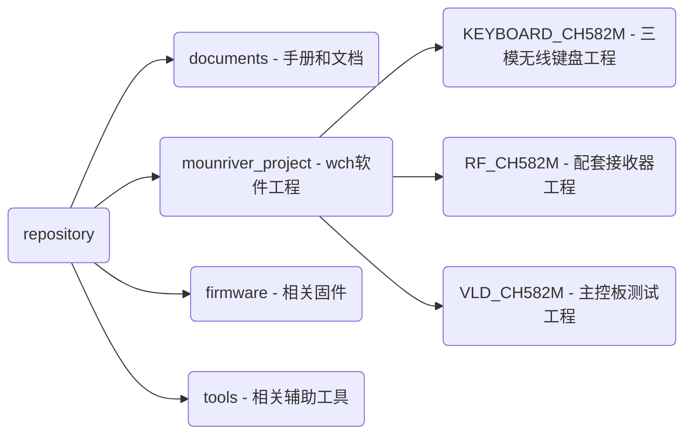

<h1 align="center">TrackPoint78 </h1>

<h5 align="center">基于CH582M的小红点三模机械键盘方案</h5>

<a href="./README.md">简体中文</a> <a href="./README-EN.md">English</a>

TP78是基于CH582M的三模机械键盘方案。以满足带有小红点 便携 无线 自定义快捷键四大根本需求为出发点设计的退烧键盘。基于CH582M三模75%配列，带有小红点(指点杆)，并使用TouchBar实现鼠标左中右键。OLED、Hub和磁吸接口。外壳可使用拓竹A1mini打印拼装。**（注意开源协议，GPL3.0，请尊重开源，欢迎交流，交流①群：678606780已满，交流②群：904775488）**

V2.0 ：视频展示：[【软软核】为自己做一把小红点三模键盘\_哔哩哔哩\_bilibili](https://www.bilibili.com/video/BV1Ho4y1b78t/)

V2.1：视频展示： [TP78指点杆三模键盘-Gasket版出炉啦 (速来拼车)_哔哩哔哩_bilibili](https://www.bilibili.com/video/BV1fA4m1V7DX/)

1. 【V2.1】更新BootLoader，支持拖拽式更新固件（仅拼车发货的板子带）
2. 【V2.1】新版Gasket结构，小尺寸3D打印/CNC优化（已使用拓竹A1mini打印验证）
3. 【V2.1】优化触摸条滑动功能
4. 支持VIA网页改键、修改配置
5. 支持USB U盘改键和配置
6. 支持触摸板触摸条操作
7. 集成USB hub接口
8. 增加USB磁吸扩展口
9. 集成RF模式和接收器方案
10. 使用I2C小红点方案
11. 使用触摸条震动反馈
12. 自研OELD UI动画
13. 多种Fn功能
14. 待机自动进lowpower模式

### 关注我们 - 获取更多开源好玩的DIY小玩意

bilibili：@i丶m皮皮 @阿炜阿阿炜阿

抖音：@i丶m皮皮

### 购买链接（支持全球可售）

[淘宝(taobao.com)](https://item.taobao.com/item.htm?id=765881659540)

### TP78支持的扩展模块列表（支持全球可售）

视频介绍：[https://www.bilibili.com/video/BV1jVpneNEpq/](https://www.bilibili.com/video/BV1jVpneNEpq/)

1. TP78foc —— 一个FOC控制无刷电机旋钮小键盘扩展模块
   
   购买链接：[淘宝(taobao.com)](https://item.taobao.com/item.htm?ft=t&id=828180761483)

2. TP78mini —— 一个三模数字小键盘模块
   
   购买链接：[淘宝(taobao.com)](https://item.taobao.com/item.htm?ft=t&id=832953135960)

扩展模块介绍视频：[【开源】历时3年，打造一个模块化力反馈旋钮小键盘](https://www.bilibili.com/video/BV1jVpneNEpq/)

### 模型开源地址

https://makerworld.com/zh/models/172159#profileId-189031

### 硬件开源地址

https://oshwhub.com/bibilala/tp78_2022-08-31

### 源码开源地址

https://github.com/ChnMasterOG/tp78_v2

### 固件下载地址

https://github.com/ChnMasterOG/tp78_v2/releases/

### 升级固件、使用教程

https://github.com/ChnMasterOG/tp78_v2/blob/main/documents/TP78v2指导文档.pdf

### 材料清单

### PCB

| PCB名称       | 功能说明                    | 板子厚度                   |
| ----------- | ----------------------- | ---------------------- |
| 0.键盘主板      | 键盘主板                    | 1.6mm（其他厚度也可以）         |
| 1.Hub供电板    | USBhub、电池充放电、电量检测       | 1.0mm                  |
| 2.Minimal_2 | M.2接口的CH582M最小系统板(外置天线) | 0.8mm（最好选择沉金）          |
| 3.触摸条       | 触摸条                     | 1.2mm （这个是裸露在外的，注意颜色哈） |
| 4.磁吸转接小板    | 磁吸扩展模块                  | 1.0mm（其他厚度也可以）         |
| 5.接收器       | 2.4GHz接收器               | 0.8mm（最好选择沉金）          |

### 外壳

| 文件名                        | 说明     |
| -------------------------- | ------ |
| 底座左 Left Bottom Case.step  | 键盘底座左侧 |
| 底座右 Right Bottom Case.step | 键盘底座右侧 |
| 定位板左 Left Plate.step       | 定位板左侧  |
| 定位板右 Right Plate.step      | 定位板右侧  |
| 上盖左 Left Top Case.step     | 上盖左侧   |
| 上盖右 Right Top Case.step    | 上盖右侧   |

### 补充五金及结构件

| 元件名称                | 规格         | 数量  | 备注                                                                                                                                                                                                                                                                                                                                                                                                                                                                                                                                                                                                                                       |
| ------------------- | ---------- | --- | ---------------------------------------------------------------------------------------------------------------------------------------------------------------------------------------------------------------------------------------------------------------------------------------------------------------------------------------------------------------------------------------------------------------------------------------------------------------------------------------------------------------------------------------------------------------------------------------------------------------------------------------- |
| M2×3 螺丝             | M2×3       | 4   |                                                                                                                                                                                                                                                                                                                                                                                                                                                                                                                                                                                                                                          |
| M2×5 螺丝             | M2×5       | 4   |                                                                                                                                                                                                                                                                                                                                                                                                                                                                                                                                                                                                                                          |
| M2×11 螺丝            | M2×11      | 8   |                                                                                                                                                                                                                                                                                                                                                                                                                                                                                                                                                                                                                                          |
| M2×2×3 滚花螺母         | M2×2×3     | 14  |                                                                                                                                                                                                                                                                                                                                                                                                                                                                                                                                                                                                                                          |
| M2×18 销柱            | M2×18      | 3   |                                                                                                                                                                                                                                                                                                                                                                                                                                                                                                                                                                                                                                          |
| 键盘定位板硅胶             | 5×8，2.8×12 | 12  | https://item.taobao.com/item.htm?_u=q2jjkhi69cd7&id=744647593898&spm=a1z09.2.0.0.af932e8d0BlsxD&sku_properties=1627207:107121                                                                                                                                                                                                                                                                                                                                                                                                                                                                                                            |
| NGFF M.2 铜柱-1.5H M3 | 1.5H M3    | 1   | https://item.taobao.com/item.htm?app=chrome&bxsign=scdEkAVMVexd7f8Q7UzuApXa4j1r_JD9G4td5HaaWVChIkPjmiw1mdLib_8g4SRe2vWDNuoFUCKcu-ejr9A1uJwoDsc538qN83wsPZPpYKL7QjkTn9bV8RsvlvkjlMOVoLH&cpp=1&id=618677416528&price=0.26-0.8&shareUniqueId=25308625613&share_crt_v=1&shareurl=true&short_name=h.5rLwYPpOifZrW9B&skuId=4836714229115&sourceType=item,item&sp_abtk=gray_1_code_simpleAndroid2&sp_tk=VG1oMFdSQ2NvUkM=&spm=a2159r.13376460.0.0&suid=95bb0d99-7ae4-428d-8994-c13b7072fe1e&tbSocialPopKey=shareItem&tk=Tmh0WRCcoRC&un=a40571f7eec624d4b0ea5e6b515c0e5c&un_site=0&ut_sk=1.YDpH0Uzm8dUDAG5lU8oOTXSt_21646297_1706280814125.Copy.1 |
| M3*4 螺丝（M.2固定用）     | M3×4       | 1   |                                                                                                                                                                                                                                                                                                                                                                                                                                                                                                                                                                                                                                          |
| 接收器外壳               |            | 1   | https://item.taobao.com/item.htm?_u=q1p8ioog4b10&id=534100629624&spm=a1z09.2.0.0.ffb12e8doHDWhm                                                                                                                                                                                                                                                                                                                                                                                                                                                                                                                                          |

### 补充连接线等电子元件

| 元件名称以及规格                  | 数量  | 备注                                                                                                                     |
| ------------------------- | --- | ---------------------------------------------------------------------------------------------------------------------- |
| YDX-C09指点杆                | 1   |                                                                                                                        |
| 指点杆帽(大方口)                 | 1   | https://item.taobao.com/item.htm?_u=q2jjkhi630e3&id=598814658945&spm=a1z09.2.0.0.af932e8dbSeo4W                        |
| 0.66寸OLED显示屏6448(ssd1306) | 1   | https://item.taobao.com/item.htm?abbucket=14&id=532909628316&ns=1&spm=a21n57.1.0.0.4d20523cgGuatR                      |
| 磁吸公+母                     | 1   | https://item.taobao.com/item.htm?_u=q1p8ioog0426&id=567899628697&spm=a1z09.2.0.0.ffb12e8doHDWhm&skuId=4855618049480    |
| MX1.25MM双头反向10p 150mm     | 1   | https://item.taobao.com/item.htm?_u=q1p8ioog7751&id=17860990732&spm=a1z09.2.0.0.ffb12e8doHDWhm                         |
| MX1.25MM双头同向6p 150mm      | 2   | https://item.taobao.com/item.htm?_u=q1p8ioog7751&id=17860990732&spm=a1z09.2.0.0.ffb12e8doHDWhm                         |
| MX1.25MM单头6p 100mm        | 1   | https://item.taobao.com/item.htm?_u=q1p8ioog9ebc&id=21014043282&spm=a1z09.2.0.0.ffb12e8doHDWhm                         |
| 2pin 震动马达电源线              | 1   | https://item.taobao.com/item.htm?_u=q1p8ioog9e2a&id=650661513310&spm=a1z09.2.0.0.ffb12e8doHDWhm                        |
| 震动马达                      | 1   | https://item.taobao.com/item.htm?_u=q1p8ioog403c&id=695661440091&spm=a1z09.2.0.0.ffb12e8doHDWhm                        |
| FPC 8p反向30cm              | 1   | https://item.taobao.com/item.htm?_u=q1p8ioog75f1&id=549590794021&spm=a1z09.2.0.0.ffb12e8doHDWhm&sku_properties=-1:-1   |
| IPEX天线 2.4G               | 1   | https://item.taobao.com/item.htm?id=590679216827&skuId=4637409672288&spm=a1z0d.6639537/tb.1997196601.52.33917484vHyEWs |

### 组装步骤

可参考V2.0视频展示后半部分

### 仓库目录

### 改键视频教程

**改键篇(上)-VIA：** https://www.bilibili.com/video/BV1rL41167qy

**改键篇(下)-按键宏：** https://www.bilibili.com/video/BV1Yu4y1S73Q

### 关于固件升级Q&A

- **Q**: 如何进入主键盘WCH的ROM bootloader（非开发者不建议操作）？

- **A:** 按住底板中BOOT键通电。

- **Q**: 如何进入主键盘kBoot？

- **A:** kBoot是TP78_v2固件配套bootloader，按下Fn+B可实现由主固件跳转至kBoot，或通过按ESC上电跳转kBoot。kBoot下格式化U盘操作相当于擦除主固件，擦除后将主固件复制到U盘选择Reboot进行固件升级。

- **Q**: 如何进入接收器的bootloader？

- **A:** 进入RF模式后连上接收器，此时按下Fn+**ESC**使接收器进入ROM bootloader。注意：接收器进入bootloader后CodeFlash首4K被擦除，上电后必须先下载程序。若同时需要升级接收器固件和键盘主体固件，优先升级接收器固件后再升级键盘主体固件。千万注意接收器固件不要刷错，否则导致无法连接从而无法再次进入bootloader。

- **Q:** 如何通过WCH工具升级固件？

- **A:** 使用WCH官方ISP工具进行固件升级(仅支持windows)，工具目录：tools/WCHISPTool/WCHISPTool_Setup.exe。
  
  > - 双击软件安装工具和相关驱动；
  > 
  > - MCU系列选择：“32位低功耗蓝牙系列”，芯片选择：CH58x，芯片型号：CH582；
  > 
  > - 在USB设备列表里找到自己的设备，若找不到尝试重新进入BOOT；
  > 
  > - 根据需求勾选相关下载配置，若不确定可进行咨询，一般使用默认配置即可；
  > 
  > - 选择目标程序文件1，并勾选右侧选项框；
  > 
  > - 最后点击下载。

- **Q**: 首次刷入固件提示FATFS-FAIL（解决方式1）。

- **A:** 第一次下载需要刷入出产固件（或者通过打开HAL.h中的FIRST_USED宏编译出产固件）。刷入后弹出U盘选择格式化。格式化后断电重启。重启再刷入正式版固件。刷入后确保正式版固件的配置信息是最新的，需要按5次Fn重置配置。重置后重启键盘就能正常使用。

- **Q**: 首次刷入固件提示FATFS-FAIL（解决方式2 - 推荐）。

- **A:** 首次刷入固件时，勾选DataFlash文件，选择firmware/DefaultFS.BIN，点击下载即可。刷入后确保固件的配置信息是最新的，需要按5次Fn重置配置。

### BUG提交与代码合入

当你在使用中遇到问题，可以在[这里](https://github.com/ChnMasterOG/tp78_v2/issues)提交你的反馈。

若你是开发者，欢迎提交代码对tp78固件进行升级。本项目会对合入代码进行自动云测，并定期自动发布release版本。

### 固件更新记录

- V2.0.11

        1. 修复部分硬件OLED上电不亮的问题

        2. Relase版本增加起始0x0地址的固件版本

        3. 修复多按键按下弹起任意一个按键导致所有按键被弹起的问题

- V2.0.12

        1. 增加游戏模式（降低键盘延迟，提升响应速度。相对地，游戏模式下关闭部分功能）

        2. 修改接收器进BOOT模式为Fn+ESC，防止按错

- V2.0.13

        1. 优化低功耗模式，修改后灭屏蓝牙不会断连

        2. 增加进入屏保和低功耗时间可配置

- V2.0.14

        1. 修复SP键无法正常工作的BUG

        2. 增加小红点读取数据期间禁用中断

- V2.0.15

        1. 修改按键弹起逻辑，避免出现重复键码

        2. 优化USB HID信息发送状态的判断

- V2.1.1

        1. 【代码逻辑优化和稳定性】优化按键按下时 HID 编码逻辑，更新 I2C 驱动

        2. 【SDK 更新】更新 WCH SDK 至 2024 年 1 月版本

        3. **【优化 2.4G 连接】更新版本后 RF 模式下 Numlock 状态会被显示在 OLED，当信号不好出现丢包后键盘会自动发起重传，默认发起重传时间为 10ms，可以通过 RF_chk_ms 参数修改时间，该功能需要同步升级接收器固件后才能生效**

        4. 【扩展模块协议】适配 miniFOC 和 TP78mini 扩展模块

        5. 【低功耗相关】低功耗相关代码更新

- V2.1.2

        1. 支持VIA修改按键宏功能（保持U盘模式修改，保持M6和M7为触摸条左右按键宏功能）

- V2.1.3

        1. 取消触摸条左中右按键振动，修复小红点和触摸条联合使用会造成小红点无法移动的

BUG

        2. 优化扩展模块连接稳定性

        3. 修改 USB/BLE/RF 的连接描述符配置，新增旋钮配置。更新版本后需要同步升级接收

器固件

        4. 更新文档，增加VIA改键说明、U盘改键说明和OLED图标描述

- V2.1.4

        1. 修复BUG：单独使用Capslock+空格模拟鼠标左右键异常（[Issue #3](https://github.com/ChnMasterOG/tp78_v2/issues/3)）

- V2.1.5

        1. 修改触摸条按键/滑动触发振动的功能为可配置（配置项：motor_en）

- V2.1.6

        1. 增加 USB 和蓝牙共存模式

        2. 修改 VIA 的 layout 布局文件，原先键盘布局为 15 列，实际只有 14 列，对应固件 VIA相关内容进行修改

- V2.1.7

        1. 修复USB模式下无法远程唤醒主机的BUG

- V2.1.8

        1. 修复 V2.1.6 和 V2.1.7 版本无法使用 RF 功能的 BUG

        2. 增加 Fn+Y 单独控制触摸条滑动使能功能，Fn+T 只控制小红点使能功能

        3. 优化游戏模式下延迟

- V2.1.9

        1. 增加 VIA 磁轴指令

        2. 增加测试模式（Fn+Z），该模式仅供新功能测试使用

- V2.1.10

        1. 增加记录上次刷入的固件版本号功能
