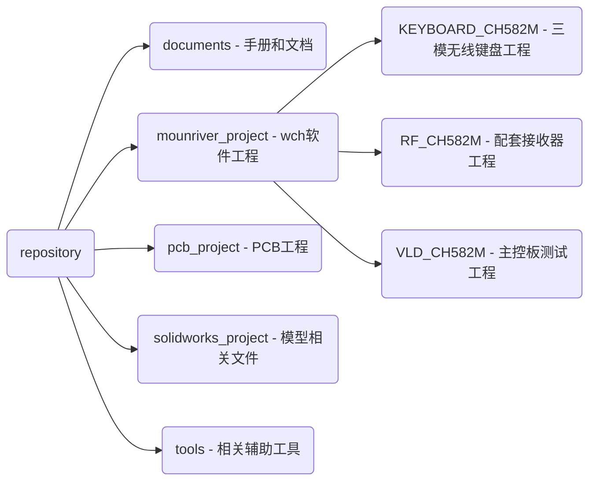

<h1 align="center">TrackPoint78 </h1>

TrackPoint78是基于CH582M的三模机械键盘方案。

V2.0新特性：

1. 支持USB U盘改键和配置

2. 支持触摸板触摸条操作

3. 集成USB hub接口

4. 增加I2C磁吸扩展口

5. 集成RF模式和接收器方案

6. 增加I2C小红点方案

7. 增加触摸条震动反馈

8. 优化OELD UI

9. 增加Fn+B进BootLoader功能

10. 增加待机自动进lowpower模式

11. ...

### 仓库目录

### 软件工程目录

### 关于固件升级Q&A

- **Q**: 如何进入主键盘的BOOTLOADER？

- **A:** 按住底板中BOOT键通电，或按下Fn+B进入BOOTLOADER。注意：Fn+B后会擦除部分CodeFlash部分片段，上电后必须先下载程序。

- **Q**: 如何进入接收器的BOOTLOADER？

- **A:** 进入RF模式后连上接收器，此时按下Fn+M使接收器进入BOOTLOADER。注意：接收器进入bootloader后CodeFlash同样被擦除，上电后必须先下载程序。若同时需要升级接收器固件和键盘主体固件，优先升级接收器固件后再升级键盘主体固件。千万注意接收器固件不要刷错，否则导致无法连接从而无法再次进入bootloader。

- **Q:** 如何升级固件？

- **A:** 使用WCH官方ISP工具进行固件升级(仅支持windows)，工具目录：tools/WCHISPTool/WCHISPTool_Setup.exe。
  
  > - 双击软件安装工具和相关驱动；
  > 
  > - MCU系列选择：“32位低功耗蓝牙系列”，芯片选择：CH58x，芯片型号：CH582；
  > 
  > - 在USB设备列表里找到自己的设备，若找不到尝试重新进入BOOT；
  > 
  > - 根据需求勾选相关下载配置，若不确定可进行咨询，一般使用默认配置即可；
  > 
  > - 选择目标程序文件1，并勾选右侧选项框；
  > 
  > - 最后点击下载。

- **Q:** 多次点击下载后，进度条跑完显示失败。

- **A:** 建议更换核心板。

- **Q**: 首次刷入固件提示FATFS-FAIL（解决方式1）。

- **A:** 第一次下载需要刷入出产固件（或者通过打开HAL.h中的FIRST_USED宏编译出产固件）。刷入后弹出U盘选择格式化。格式化后断电重启。重启后按Fn+B进入BootLoader并刷入正式版固件。刷入后确保正式版固件的配置信息是最新的，需要按5次Fn重置配置。重置后重启键盘就能正常使用。

- **Q**: 首次刷入固件提示FATFS-FAIL（解决方式2 - 推荐）。

- **A:** 首次刷入固件时，勾选DataFlash文件，选择firmware/DefaultFS.BIN，点击下载即可。刷入后确保固件的配置信息是最新的，需要按5次Fn重置配置。
